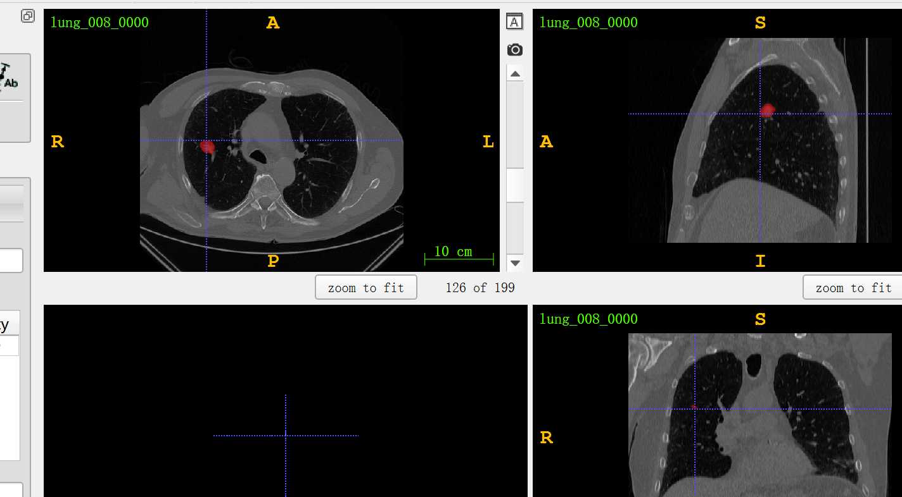
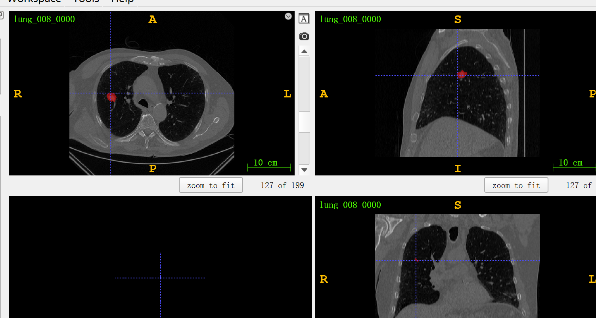

# nnUNet_paddle


## 1 简介 
本项目基于paddlepaddle框架复现了nnUNet.

预测示例： 
coming soon

声明：  
1、nnUNet官方repo训练的epoch为1000，单个epoch单卡Tesla v100 单卡约耗时8-10分钟，完整的训练需要1000x5x3x8 分钟，成本太高，本次复现减少了训练iters；   
2、casacade stage2效果比不上casacade stage1，因为比赛快结束了，stage2训练实在太慢，进一步降低了iters。   


**论文：**
- [1] Fabian Isensee, Jens Petersen, Andre Klein, David Zimmerer, Paul F. Jaeger, Simon Kohl, Jakob Wasserthal, Gregor Köhler, Tobias Norajitra, Sebastian Wirkert, and Klaus H. Maier-Hein. [nnU-Net: Self-adapting Framework for U-Net-Based Medical Image Segmentation](https://arxiv.org/abs/1809.10486)

**项目参考：**
- [https://github.com/MIC-DKFZ/nnUNet](https://github.com/MIC-DKFZ/nnUNet)

## 2 复现精度
>msd lung数据集的测试效果如下表。    
所有权重链接：[https://aistudio.baidu.com/aistudio/datasetdetail/150774](https://aistudio.baidu.com/aistudio/datasetdetail/150774)           


| NetWork  | post_processing  | folds  | steps |opt| image_size | batch_size |dataset|memory|card|  avg dice  |                                             config                                              |                          weight                           |             log             |
|:--------:|:--------:|:--------:|:-----:| :---: |:----------:|:----------:| :---: | :---: | :---: |:------:|:-----------------------------------------------------------------------------------------------:|:---------------------------------------------------------:|:---------------------------:|
| nnUNet_2d | False | 5 | 25k/30k  |Adam| -  |     -     |MSD LUNG|32G|1| 52.397% | - | - | - |
| nnUNet_2d | True | 5 | 25k/30k  |Adam| -  |     -     |MSD LUNG|32G|1| 53.549% | - | - | - |
| nnUNet_cascade_stage1 | False | 5 | 25k  |Adam| -  |     -     |MSD LUNG|32G|1| 67.676% | - | - | - |
| nnUNet_cascade_stage1 | True | 5 | 25k  |Adam| -  |     -     |MSD LUNG|32G|1| 68.281% | - | - | - |
| nnUNet_cascade_stage2 | False | 5 | 20k  |Adam| -  |     -     |MSD LUNG|32G|1| 59.953% | - | - | - |
| nnUNet_cascade_stage2 | True | 5 | 20k  |Adam| -  |     -     |MSD LUNG|32G|1| 67.764% | - | - | - |
| nnUNet_cascade_stage2 | False | 5 | 20k  |Adam| -  |     -     |MSD LUNG|32G|1| 59.953% | - | - | - |
| nnUNet_cascade_stage2 | True | 5 | 20k  |Adam| -  |     -     |MSD LUNG|32G|1| 67.764% | - | - | - |
| ensemble_2d_3d_cascade | False | 5 | -  |-| -  |     -     |MSD LUNG|32G|1| 61.716% | - | - | - |
| ensemble_2d_3d_cascade | True | 5 | -  |-| -  |     -     |MSD LUNG|32G|1| 62.171% | - | - | - |


## 3 数据集
[MSD Lung](https://aistudio.baidu.com/aistudio/datasetdetail/125872)


## 4 环境依赖
- 硬件: Tesla V100 * 1

- 框架:
    - PaddlePaddle == 2.2.2


## 快速开始  
开始前请先准备好数据，在对应的config目录中配置好你的文件路径。  

### 第一步：克隆本项目
```bash
# clone this repo
git clone https://github.com/justld/nnunet_paddle.git
cd nnunet_paddle
```

**安装第三方库**
```bash
pip install -r requirements.txt
```


### 第二步：训练模型
     
nnunet_2d训练(5折验证，一共5个配置文件，自行更改)：
```bash
python train.py --config configs/msd/msd_lung_2d_fold_0.yml --use_vdl --do_eval --log_iters 10 --save_interval 1000 --seed 10000 --precision fp16 --save_dir output/nnunet_2d/fold_0
```

nnunet_3d_stage1训练(5折验证，一共5个配置文件，自行更改)：  
```bash
python train.py --config configs/msd/msd_lung_3d_fold_0.yml --use_vdl --do_eval --log_iters 10 --save_interval 1000 --seed 10000 --precision fp16 --save_dir output/nnunet3d_stage0/fold_0
```

nnunet_3d_stage2训练(5折验证，一共5个配置文件，自行更改)：  
```bash
python train.py --config configs/msd/msd_lung_3d_fold_0_stage1.yml --use_vdl --do_eval --log_iters 10 --save_interval 1000 --seed 10000 --precision fp16 --save_dir output/nnunet3d_stage1/fold_0
```

### 第三步：验证

nnunet_2d 验证（val_save_folder为验证集预测结果保存目录，5折依次更改权重和配置文件）：
```bash
python nnunet_tools/nnunet_fold_val.py --config configs/msd/msd_lung_2d_fold_0.yml \
    --model_path output/nnunet_2d/fold_0/best_model/model.pdparams --precision fp16 --save_dir ~/val_2d --val_save_folder ~/val_2d
	
python nnunet_tools/nnunet_fold_val.py --config configs/msd/msd_lung_2d_fold_1.yml \
    --model_path output/nnunet_2d/fold_1/iter_30000/model.pdparams --precision fp16 --save_dir ~/val_2d --val_save_folder ~/val_2d
	
python nnunet_tools/nnunet_fold_val.py --config configs/msd/msd_lung_2d_fold_2.yml \
    --model_path output/nnunet_2d/fold_2/best_model/model.pdparams --precision fp16 --save_dir ~/val_2d --val_save_folder ~/val_2d

python nnunet_tools/nnunet_fold_val.py --config configs/msd/msd_lung_2d_fold_3.yml \
    --model_path output/nnunet_2d/fold_3/best_model/model.pdparams --precision fp16 --save_dir ~/val_2d --val_save_folder ~/val_2d
	
python nnunet_tools/nnunet_fold_val.py --config configs/msd/msd_lung_2d_fold_4.yml \
    --model_path output/nnunet_2d/fold_4/best_model/model.pdparams --precision fp16 --save_dir ~/val_2d --val_save_folder ~/val_2d
	
# 5折总验证
python nnunet_tools/all_fold_eval.py --gt_dir ~/val_2d/gt_niftis --val_dir ~/val_2d

```

nnunet_3d_cascade stage2 验证（val_save_folder为验证集预测结果保存目录，5折依次更改权重和配置文件）：
```bash
python nnunet_tools/nnunet_fold_val.py --config configs/msd/msd_lung_3d_fold_0_stage1.yml --model_path output/nnunet3d_stage1/fold_0/iter_16000/model.pdparams --precision fp16 --save_dir ~/val_3d_stage1 --val_save_folder ~/val_3d_stage1

python nnunet_tools/nnunet_fold_val.py --config configs/msd/msd_lung_3d_fold_1_stage1.yml --model_path output/nnunet3d_stage1/fold_1/iter_20000/model.pdparams --precision fp16 --save_dir ~/val_3d_stage1 --val_save_folder ~/val_3d_stage1

python nnunet_tools/nnunet_fold_val.py --config configs/msd/msd_lung_3d_fold_2_stage1.yml --model_path output/nnunet3d_stage1/fold_2/iter_20000/model.pdparams --precision fp16 --save_dir ~/val_3d_stage1 --val_save_folder ~/val_3d_stage1

python nnunet_tools/nnunet_fold_val.py --config configs/msd/msd_lung_3d_fold_3_stage1.yml --model_path output/nnunet3d_stage1/fold_3/iter_20000/model.pdparams --precision fp16 --save_dir ~/val_3d_stage1 --val_save_folder ~/val_3d_stage1

python nnunet_tools/nnunet_fold_val.py --config configs/msd/msd_lung_3d_fold_4_stage1.yml --model_path output/nnunet3d_stage1/fold_4/iter_20000/model.pdparams --precision fp16 --save_dir ~/val_3d_stage1 --val_save_folder ~/val_3d_stage1

# 5折总验证
python nnunet_tools/all_fold_eval.py --gt_dir ~/val_3d/gt_niftis --val_dir ~/val_3d_stage1

```

ensemble（nnunet_2d_val_dir为nnunet2d验证结果目录，nnunet_3d_cascade_val_dir为cascade验证结果目录，plan_2d_path为plan路径，gt_dir为gt_segmentations目录）: 
```
python nnunet_tools/ensemble.py --nnunet_2d_val_dir ~/val_2d --nnunet_3d_cascade_val_dir ~/val_3d_stage1 --ensemble_output ~/nnunet_ensembles --plan_2d_path /home/aistudio/data/preprocessed/Task006_Lung/nnUNetPlansv2.1_plans_3D.pkl \
    --gt_dir /home/aistudio/data/preprocessed/Task006_Lung/gt_segmentations
```

### 第四步：动态图推理  
首先修改权重路径，如下(五折共有5个文件夹)：   
|-output  
|--fold_0  
|---model.pdparams  
|--...  

|配置|含义|
|:---:|:---:|
|input_folder(i)|待预测的文件夹路径|
|output_folder(o)|保存的路径|
|plan_path|配置文件路径|
|model_dir|权重模型文件夹(上方示例的output目录)|
|folds|验证的折数|
|postprocessing_json|后处理的json路径，在上一步all_fold_eval.py输出的文件夹内|
|lowres_segmentations|如果是cascade网络，则对应第一阶段输出的目录|
|model_lowres_dir|如果是级联网络，对应第一阶段模型的目录|
|model_lowres_postprocessing_json_path|第一阶段后处理的json路径|


以级联第一阶段为例，进行预测，预测结果见下图(msd lung测试集008.ii.gz)：
```
python nnunet_tools/predict.py -i ~/data/Task006_Lung/imagesTs \
    -o ~/nnunet_predict/predict_3d \
    -plan_path /home/aistudio/data/preprocessed/Task006_Lung/nnUNetPlansv2.1_plans_3D.pkl \
    -model_dir ~/MedicalSeg/output/nnunet3d_stage0  -folds 5 \
    -postprocessing_json_path ~/val_3d_stage0/postprocessing.json \
```


### 第五步：导出
以级联第一阶段为例，需要注意的是，请带上--without_argmax --with_softmax参数，模型输出为概率。
```
python export.py \
       --config configs/msd/msd_lung_3d_fold_4.yml \
       --model_path ~/MedicalSeg/output/nnunet3d_stage0/fold_0/model.pdparams \
       --save_dir output --without_argmax --with_softmax
```

### 第六步：静态图预测
以上一步导出的静态图模型进行预测，(暂时不支持第二阶段级联预测和多折预测)，预测结果见下图。
```
python nnunet_tools/nnunet_infer.py \
    --config output/deploy.yaml \
    --image_path ~/data/Task006_Lung/imagesTs/lung_008_0000.nii.gz \
    --save_dir output/infer/ \
    --plan_path /home/aistudio/data/preprocessed/Task006_Lung/nnUNetPlansv2.1_plans_3D.pkl \
    --stage 0
```


### 第七步：tipc
快速验证tipc，请参考命令（这里没有放效果图，因为训练20iter，全部预测都是背景）：   
```
bash test_tipc/test_train_inference_python.sh ./test_tipc/configs/nnunet/train_infer_python.txt 'lite_train_lite_infer'
```

说明：tipc总耗时约5分钟（需要提前预处理好数据集，否则tipc耗时2H以上，[tipc日志](test_tipc/tipc_log.txt)）

注意事项：  
1、test_tipc/configs/nnunet/train_infer_python.txt中的配置文件路径需要修改，测试数据的路径需要修改；


## 6 模型信息

相关信息:

| 信息 | 描述                                                                                                                                              |
| --- |-------------------------------------------------------------------------------------------------------------------------------------------------|
| 作者 | 郎督                                                                                                                                              |
| 日期 | 2022年6月                                                                                                                                         |
| 框架版本 | PaddlePaddle==2.2.2                                                                                                                             |
| 应用场景 | 医疗图像分割                                                                                                                                            |
| 硬件支持 | GPU                                                                                                                                         |
| 在线体验 |-|


